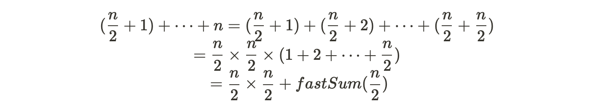
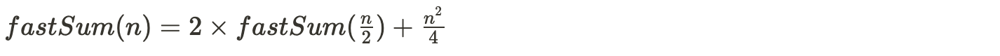

# 6. 분할 정복

## 도입

분할 정복 패러다임을 차용한 알고리즘들은 주어진 문제를 둘 이상의 부분 문제로 나눈 뒤 각 문제에 대한 답을 재귀 호출을 이용해 계산하고, 각 부분 문제의 답으로부터 전체 문제의 답을 계산해낸다.

분할 정복 알고리즘은 다음 세가지의 구성 요소를 가진다.

- 문제를 더 작은 문제로 분할하는 과정(divide)
- 각 문제에 대해 구한 답을 원래 문제에 대한 답으로 병합하는 과정(merge)
- 더이상 답을 분할하지 않고 곧장 풀 수 있는 매우 작은 문제(base case)

### 예제: 수열의 빠른 합과 행렬의 빠른 제곱

1부터 n까지의 합을 구하는 `fastSum`함수를 작성한다고 하자(n이 짝수라 가정)


위 식에서 fastSum(n/2)까지는 표현이 가능하나 그 이후 부분을 표현할 수가 없다. 이를 다음과 같이 바꿔주면



이를 이용해서 최종적으로 다음과 같이 정리가 가능하다.



이제 n이 홀수인 경우까지 고려해서 다음과 같이 알고리즘을 만들 수 있다.

```java
int fastSum(int n) {
	if (n == 1) return 1;
	if (n % 2 == 1) return fastSum(n - 1) + n;
	return 2 * fastSum(n/2) + (n / 2) * (n / 2);
}
```

#### 시간 복잡도

일반적인 수열의 합 알고리즘의 시간복잡도는 O(n)이나 `fastSum` 의 경우 O(logN)이 된다.

#### 행렬의 거듭제곱

n x n 행렬 A의 거듭제곱 A^m을 구한다고 할 때 일반적인 방법으로 구한다면 행렬의 곱셉에 O(n^3)의 시간이 들기에 O(n^3 \* m) 의 연산이 필요하다. 이를 분할 정복을 이용한다면 더 빨리 계산이 가능하다.

```java
class SquareMatrix;

SquareMatrix identity(int n);

SquareMatrix pow(SquareMatrix A, int m) {
	if (m == 0) return identity(A.size());
	if (m % 2 > 0) return SquareMatrix.multiply(pow(A, m-1), A);
	SquareMatrix half = pow(A, m /2);
	return SquareMatrix.multiply(half, half);
}
```

#### 나누어 떨어지지 않을 때 분할과 시간 복잡도

m이 홀수일 때 A^m = A \* A^(m-1)로 나누지 않고 절반으로 나눌 경우 기저 사례까지의 분할 횟수가 줄어들기에 더 좋지 않냐는 의문이 생길 수 있다. 하지만 실제로 이 경우 계산 과정에서 생긴 각 부분 문제가 여러번 더 호출이 되는 경우가 생긴다(책 그림 참고) 따라서 전체 호출 횟수가 O(logm)이 아닌 선형에 가까워 질 수 있다. 이에 반해 기존 구현의 경우는 각 부분 문제가 한번 씩 호출되어 전체 호출수가 O(logm)이 된다.

따라서 분할 정복에서 분할 계획을 세울 때 상황에 따라 알맞은 분할 전략을 세워야 한다.

### 예제: 병합 정렬과 퀵 정렬

병합 정렬과 퀵 정렬 알고리즘은 대표적인 분할 정복 알고리즘이다. 두 정렬의 차이점은 시간이 많이 걸리는 정렬 작업을 분할단계에서 처리하느냐, 병합 단계에서 처리하느냐이다.

#### 시간 복잡도

병합 정렬의 경우 분할을 항상 절반으로 한다. 따라서 병합 정렬에서 처리할 단계의 수는 O(logn)이 된다. 그리고 시간이 많이 걸리는 병합 단계의 시간 복잡도는 O(n)으로 최종 시간 복잡도는 익히 알듯이 O(nlogn)이 된다.

퀵 정렬의 경우 기준을 정해 분할을 한다. 따라서 일반적으로는 O(logn)이지만 최악의 경우가 존재하며 이 경우 처리해야할 단계 수가 O(n)이 되고, 시간이 많이 걸리는 분할 작업의 경우 O(n)이 걸리므로 일반적으로는 O(nlogn), 최악으로 O(n^2)이 나올 수 있다.

### 예제: 카라츠바의 곱셈 알고리즘

큰 수의 곱셈에서 주로 사용하는 방법은 초등학교 때 배운 곱셈 방법을 활용하는 것이다. 배열을 이용해 배열의 각 원소에 수의 각 자리수를 저장하며 이를 초등학교 산수(책 그림 참조)와 같이 각 자릿수부터 계산을 하는 방식을 한다. 이 경우 시간 복잡도는 n자리 정수 두개를 곱할 경우 O(n^2)이 된다.

카라츠바의 알고리즘은 다음과 같이 두 수(256자리)를 각각 절반으로 쪼갠다.


이 때 카라츠바의 방식으로 a x b를 다음과 같이 네 조각을 이용해 나타낼 수 있다.


하지만 이 경우 결국 전체 수행 시간이 O(n^2)이 돼서 의미가 없어진다.(책 참고)

따라서 카라바츠는 이를 위해 네 조각을 세 조각으로 분리했다.


따라서 이 경우 곱셈을 세 번 밖에 쓰지 않게 되고 이를 이용해 알고리즘을 구현할 수 있다.

#### 시간 복잡도

카라바츠 알고리즘의 수행시간은 기저 사례과 병합 단계의 두 부분에 의해 지배된다. 다시 기저 사례는 곱셈 부분, 병합 단계는 큰 수의 덧셈, 뺄셈 부분에 수행 시간이 지배된다.

한자리 숫자에 도달(기저 사례)해야 곱셈을 하고 n이 2의 k거듭제곱이라 가정할 때, 먼저 재귀호출의 깊이가 k가 되고, 한번 쪼갤 때 마다 3개의 부분문제가 생기므로 총 3^k개의 부분 문제가 생긴다. 곱셈의 경우 O(1)의 수행시간을 가지므로 따라서 수행 시간은 O(3^k) = O(n^(log3))이 된다.

덧셈, 뺄셈의 경우 숫자의 길이에 비례하는 시간이 걸리고, 따라서 전체 수행 과정에서 각 단계에 해당하는 숫자의 길이를 모두 더하면 병합 단계에 드는 시간을 구할 수 있다. 이를 계산하는 함수를 구하면 결국 n^(log3)과 같은 속도로 증가하기에 전체 시간 복잡도는 곱셈이 지배하며 최종적으로 O(n^(log3))이 된다.

## 문제

1. [쿼드 트리 뒤집기 (QUADTREE)](https://www.algospot.com/judge/problem/read/QUADTREE)

2. [울타리 잘라내기 (FENCE)](https://www.algospot.com/judge/problem/read/FENCE)

3. [팬미팅 (FANMEETING)](https://www.algospot.com/judge/problem/read/FANMEETING)
