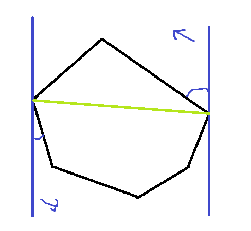

# 15. Computational Geometry

2020.09.02.

Byeongsu Kim


점, 선, 다각형, 원 등 다양한 기하학적 도형을 다루는 알고리즘을 Computational Geometry Algorithm이라고 한다. 3D 그래픽, 캐드, 로보틱스 등 다양한 분야의 기반이 되기 때문에 전산학 전반적으로 매우 중요한 역할을 차지하고 있다. 그 중요한 역할을 대변하듯 매우 많은 주제를 포함하는 광범위한 학문으로 발전되고 있지만, 프로그래밍 대회에서 나오는 부분들은 비교적 기초적인 부분들로 제한된다. 이처럼 기초적인 문제를 해결하는 데는 거창한 알고리즘이나 설계 패러다임 보다는 대개 학부 선형대수, 고등학교 수준의 기하학으로도 충분히 해결할 수 있다. 그렇다면 남은 문제는 수학적으로 알고 있는 논리들을 코드로 변환하여 실제 문제를 해결할 수 있도록 구현 할 수 있는가가 중요한 능력이 된다. 지금까지 1차원의 문제를 주로 해결했다면 다차원의 문제를 수학적으로 해결하고, 코드로 구현하는 것이 이번 장에서 중요한 목표이기 때문에 2차원 기하학만을 다뤄보자.


### Tools for Computational Geometry

Computational Geometry를 코드로 구현하기 위해 필수적으로 사용해야 하는 개념들을 먼저 정의하자.

- Vector

  2차원 평면 위에 있는 서로 다른 두 점의 상대적 위치를 표현하는 가장 간편한 방법은 vector이다.

  이 vector를 잘 활용하기 위해서는 다양한 operation들을 정의해야 한다.

  ```c++
  const double PI = 2.0 * acos(0.0);
  
  //c++의 stl library에는 vector가 정의되어 있으므로 이번에 새로 정의할 vector는 vector2로 명명하자
  struct vector2 {
      double x, y;
      //생성자를 explicit으로 정의하면 vector2를 넣을 곳에 잘못해 실수가 들어가는 일을 방지해 준다.
      explicit vector2(double x_ = 0, double y_ = 0): x(x_), y(y_) {}
      
      //비교
      bool operator == (const vector2& rhs) const {
          return x == rhs.x && y == rhs.y;
      }
      bool operator < (const vector2& rhs) const {
          return x != rhsx ? x < rhs.x  : y < rhs.y;
      }
      
      //sum and sub
      vector2 operator + (const vector2& rhs) const {
          return vector2(x+rhs.x, y+rhs.y);
      }
      vector2 operator - (const vector2& rhs) const {
          return vector2(x-rhs.x, y-rhs.y);
      }
      
      //mux
      vector2 operator * (double rhs) const {
          return vector2(x * rhs, y * rhs);
      }
      
      //length
      double norm() const { return hypot(x, y); }
      
      //nomalization to itself
      vector2 normalize() const {
          return vector2(x / norm(), y / norm());
      }
      
      //angle
      double polar() const { return fmod(atan2(y, x) + 2*PI, 2*PI); }
      
      //dot product and cross product
      double dot(const vector2& rhs) const {
          return x*rhs.x + y*rhs.y;
      }
      double cross(const vector2& rhs) const {
          return x*rhs.y - rhs.x*y;
      }
      
      //projection
      vector2 project(const vector2& rhs) const {
          vector2 r= rhs.normalize();
          return r* r.dot(*this);
      }
  }
  ```

  위에서 정의한 vector를 활용하면 점, 직선, 선분을 간편히 표현할 수 있다.

  이를 활용하여 세 개의 점 p, a, b가 주어졌을 때 a가 b보다 p에 얼마나 더 가까운지를 return 하는 함수를 아래와 같이 간단히 구현할 수 있다.

  ```c++
  double howMuchCloser(vector2 p, vector2 a, vector2 b) {
      return (b - p).norm() - (a - p).norm();
  }
  ```

  외에도 내적, 외적이 정의되어 있기 때문에 아래와 같이 다양한 연산을 쉽고 간단히 할 수 있다.

  - 벡터 사이 각 구하기
  - 벡터의 직각 여부 확인하기
  - 면적 계산하기
  - 두 벡터의 방향 판별하기


### 교차와 거리, 면적

- 직선과 직선의 교차

  직선과 직선의 교차 여부를 확인하고 교차점을 구하는 것은 매우 자주 나오는 유형이고, 우리가 손으로 아주 쉽게 계산할 수 있지만, 코드로 작성하기는 꽤 까다로운 부분이 있다. 평행과 같은 특이점을 모두 고려해 주어야 하기 때문이다.

  그러나 벡터를 확용하여 연립방정식을 세우고, 해당 방정식을 풀어 나온 간단한 식을 코드로 아래와 같이 변환하면 간결하게 해결할 수있다.

  ```c++
  //(a, b)를 포함하는 직선과 (c, d)를 포함하는 선의 교점을 x에 반환
  //두 선이 평행이면 false, 아니면 true
  bool lineIntersection(vector2 a, vector2 b, vector2 c, vector2 d, vector2& x) {
      double det = (b-a).cross(d-c);
      if(fabs(det) < EPSILON) return false;
      x = a + (b - a) * ((c - a).cross(d - c) / det);
      return true;
  }
  ```

- 선분과 선분의 교차

  끊어져 있는 것은 특이점이고, 특이점이 존재한다는 것은 자연스럽지 않으므로 직선의 관계를 계산하는 것 보다 선분의 관계를 계산하는 것이 더 어렵다는 것은 쉽게 알 수 있다.

  선분은 아래의 4가지 관계로 존재할 수있는데, 평행하고 겹치는 경우에는 네가지 모두에 해당할 수 있기 때문에 끝점을 확인해야 한다.

  - 두 선분이 서로 겹치지 않음
  - 두 선분이 한 점에서 닿음
  - 두 선분이 겹침
  - 한 선분이 다른 선분 안에 포함됨

  이를 모두 고려한 코드는 아래와 같다.

  ```c++
  bool parallelSegments(vector2 a, vector2 b, vector2 c, vector2 d, vector2& p) {
      if(b < a) swap(a, b);
      if(d < c) swap(c, d);
      //한 직선 위에 없거나 두 선분이 겹치지 않는 경우를 우선 걸러낸다.
      //ccw는 각 점이 시계방향이면 -1, 일직선이면 0, 반시계방향이면 1
      if(ccw(a, b, c) != 0 || b < c || d < a) return false;
      //두 선분은 확실히 겹친다. 교차점을 하나 찾자.
      if(a < c) p = c; else p = a;
      return true;
  }
  //p가 (a, b)를 감싸면서 각 변이 x,y축에 평행한 최소사각형 내부에 있는지 확인한다.
  //a, b, p는 일직선 상에 있을 때 사용
  bool inBoundingRectangle(vector2 p, vector2 a, vector2 b) {
      if(b < a) swap(a, b);
      return p == a || p == b || (a < p && p < b);
  }
  //(a, b)선분과 (c, d)선분의 교점을 p에 반환
  //교점이 여러 개일 경우 아무 점이나 반환
  //두 선분이 교차하지 않을 경우 false
  bool segmentIntersection(vector2 a, vector2 b, vector2 c, vector2 d, vector2* p) {
      if(!lineIntersection(a, b, c, d, p))
          return parallelSegments(a, b, c, d, p);
      return inBoundingRectangle(p, a, b) && inBoundingRectangle(p, c, d);
  }
  ```

  위의 코드에서는 교차점을 찾기 위해 복잡하게 시도했지만 교차점을 알 필요가 없으면 좀 더 간단하게 교차 여부를 아래와 같이 확인할 수 있다.

  ```c++
  bool segmentIntersects(vector2 a, vector2 b, vector2 c, vector2 d) {
      double ab = ccw(a, b, c) * ccw(a, b, d);
      double cd = ccw(d, d, a) * ccw(c, d, b);
      if(ab == 0 && cd == 0){
          if(b < a) swap(a, b);
          if(d < c) swap(c, d);
          return !(b < c || d < a);
      }
      return ab <= 0 && cd <= 0;
  }
  ```

- 점과 직선 사이의 거리

  ```c++
  vector2 perpendicularFoot(vector2 p, vector2 a, vector2 b) {
      return a + (p - a).project(b - a);
  }
  double pointToLine(vector2 p, vector2 a, vector2 b) {
      return (p - perpendicularFoot(p, a, b)).norm();
  }
  ```


### Polygon

현실 세계를 계산 기하로 변환하는데 매우 중요하기 때문에 자주 마주할 수 있다.

- 다각형의 종류

  - 볼록다각형 (convex polygon)

    모든 내각이 180도 미만인 다각형

  - 오목다각형 (concave polygon)

    180도를 넘는 내각을 가진 다각형

  - 단순 다각형 (simple polygon)

    다각형의 경계가 스스로를 교차하지 않는 다각형

- 면적 구하기

  외적을 활용하여 삼각형의 세 점에서 그 면적을 구할 수 있다는 것을 활용하면 볼록 다각형과 오목 다각형에 관계없이 쉽게 계산할 수 있다.

  ```c++
  double area(const vector<vector2>& p) {
      double ret = 0;
      for(int i = 0; i < p.size(); i++) {
          int j = (i+1) % p.size();
          ret += p[i].cross(p[j]);
      }
      return fabs(ret) / 2.0;
  }
  ```

- 내부 / 외부 판별

  단순 다각형과 이 다각형의 경계 위에 있지 않은 점 q가 주어질 떄 q가 다각형의 내부에 있는지 외부에 있는지를 확인하는 함수를 만들고자 한다.

  이런 함수를 만드는 유명한 방법은 q에서 시작해 오른쪼긍로 쭉 뻗어나가는 반직선을 상상하고, 이 반직선이 다각형과 몇 번이나 교차하는지를 확인하는 것이다. (물리에서 도체가 있을때 flex 구할때 쓰는 방법) 짝수번 교차하면 외부에 있고, 홀수번 교차하면 내부에 있다. 

  그러나 인생은 쉽지 않다. 다양한 예외가 존재한다. 반직선이 다각형의 변이 아닌 한 꼭짓점과 겹친다면? 반직선이 변과 평행해 겹친다면?

  다양한 예외를 해결하기 위해 epsilon을 도입한다. epsilon만큼 반직선을 위로 살짝 올려 연산하면 문제를 해결할 수 있다. 이를 적용한 함수의 구현은 아래와 같다.

  ```c++
  bool isInside(vector2 q, const vector<vector2>& p) {
      int crosses = 0;
      for(int i = 0; i < p.size(); i++) {
          int j = (i + 1) % p.size();
          //(p[i], p[j])가 반직선을 세로로 가로지르는가?
          if((p[i].y > q.y) != (p[j].y - q.y)) {
              double atX = (p[j].x - p[i].x) * (q.y - p[i].y) / 
                  		 (p[j].y - p[i].y) + p[i].x;
              if(q.x < atX) crosses++;
          }
      }
      return crosses%2 > 0;
  }
  ```


### 계산 기하 알고리즘 디자인 패턴

많은 계산기하 문제는 우리가 여기서 다룬 코드들의 조합으로 풀 수 있다. 그러나 보통 이 코드들을 응용하여 더 복잡한 알고리즘을 만들어야 한다. 이럴 때는 기하 알고리즘의 디자인 패턴이 더 효율적인 코드를 만드는데 도움이 되는 경우가 많다.

- 평면 스위핑

  가장 유명한 계산 기하 알고리즘 디자인 패턴으로 plane sweeping 혹은 line weeping이라고 불린다.

  평면을 쓸고 지나가면서 문제를 해결하는 것이 key feature이다.

  - 직사각형 합집합의 면적

    x축과 y축에 각 변이 평행한 직사각형들이 여러 개 주어질 때 이들의 합집합의 면적을 구하는 문제를 위 평면 스위핑을 활용하여 간결하게 풀 수 있다. 기존의 포함-배제 원칙을 이용해 해결하면 문제를 푸는데 너무 오랜 시간이 걸린다.

    알고리즘을 간단하게 요약하면 다음과 같다.

    - 단면의 길이가 변하는 지점은 직사각형의 왼쪽 끝이나 오른쪽 끝 뿐이기 때문에 이 위치들을 event라고 부르자.
    - 각 이벤트들의 위치를 미리 계산해 정렬해 두면 각 이벤트 사이의 높이는 변하지 않는다.
    - 각 이벤트 사이의 거리와 해당 위치의 높이를 곱해 합하면 답을 쉽게 얻을 수 있다.

    event와 ys의 원소 수가 각각 O(N)이기 때문에 알고리즘의 전체 시간복잡도는 O(N^2)가 된다. 구간트리를 활용하면 O(NlogN)까지 줄일 수도 있다.

  - 다각형 교집합의 넓이 구하기

  - 교차하는 선분들

- 회전하는 캘리퍼스

  또다른 유명한 계산 기하 알고리즘 디자인 패턴으로 rotating calipers라고 부르는 것이 있다.

  무언가를 재는 과정을 알고리즘으로 옮기는데, 캘리퍼스의 아이디어를 활용해 효율적으로 풀 수 있다.

  - 볼록 다각형의 지름

    볼록 다각형의 지름은 볼록 다각형에 오나전히 포함되는 가장 긴 선분의 길이로 정의한다.

    이 문제를 푸는 가장 단순한 방법은 모든 꼭짓점의 쌍을 순회하면서 이 중 서로 가장 멀리 떨어져 있는 쌍을 찾는 것이다. 이 방법은 점의 수 N에 대해 O(N^2)의 시간 복잡도를 갖게 된다.

    회전하는 캘리퍼스의 아이디어를 적용하면 다각형을 평행한 두 직선 사이에 끼우고, 다각형을 따라 직선을 한 바퀴 돌리면서 직선에 닿는 꼭지점들 간의 거리를 재어 풀 수 있다.

    - 가장 왼쪽 점과 가장 오른쪽 점을 찾아낸 뒤, 각각에 두 개의 수직선을 붙인다. 이 때 두 벡터의 방향은 항상 반대이기 때문에, 첫 번째 직선의 방향 벡터만을 저장한느 것으로 충분하다.
    - 반복문 내에서 두 직선을 시계 반대 방향으로 돌렸을 때 어느 쪽이 먼저 다각형의 다른 점을 만나는지를 계산한다. 이를 위해 현재 수직선의 방향과 다음 점까지의 방향 사이의 각도를 계산해야 한다.
    - 이 두 각도 중 더 작은 쪽을 택해 두 직선을 회전하면서 지름을 계산한다.

    


### 자주 하는 실수와 유의점들

예외가 드럽게 많다.

- 퇴화 도형

  예외를 고려해야 한다.

  - 일직선 상에 있는 세 개 이상의 점들
  - 서로 평행이거나 겹치는 직선/선분들
  - 넓이가 0인 다각형들
  - 다각형의 변들이 서로 겹치는 경우

- 직교좌표계와 스크린 좌표계

  스크린에 좌표계를 그리면 y축의 부호가 반대이다.

- 다른 실수들

  실수, 정수..


### Problems

- [핀볼 시뮬레이션(ID: PINBALL, 난이도: 상)](https://www.algospot.com/judge/problem/read/PINBALL)
- [보물섬(ID: TREASURE, 난이도: 상)](https://www.algospot.com/judge/problem/read/TREASURE)
- [너드인가, 너드가 아닌가?(ID: NERDS, 난이도: 중)](https://www.algospot.com/judge/problem/read/NERDS)
