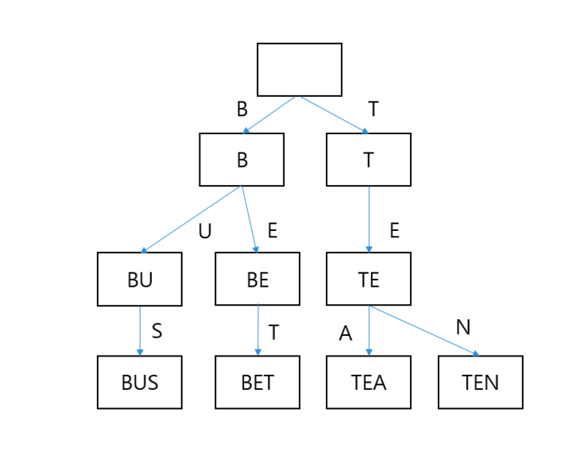

# 26. Trie

## 도입

정수나 실수형 변수는 크기가 일정하므로 비교에 상수시간이 걸린다고 가정해도 된다. 하지만 문자열 변수를 비교할 시 최악의 경우 문자열의 길이에 비례하는 시간이 걸린다.N개의 원소를 가지는 이진 검색 트리에서 원소를 찾으려면 O(logN)의 비교를 해야하며 여기에서 문자열을 찾는다고 하면 최종 복잡도는 O(MlogN)이 된다.

이와 같이 문자열의 검색의 경우 시간 복잡도가 매우 크기에 이를 단축시키기 위해 고안된 문자열 자료구조가 바로 트라이(TRIE)이다. 트라이는 문자열의 집합을 표현하는 트리 자료구조로, 집합 내에서 원하는 원소를 찾는 작업을 O(M)시간만에 할 수 있다.



트라이는 집합에 포함된 문자열의 접두사들에 대응되는 노드들이 서로 연결된 트리이다. 한 접두사의 맨 뒤에 글자를 덧 붙여 다른 접두사를 얻을 수 있을 때 두 노드는 부모 자식관계로 연결된다. 두 노드를 연결하는 간선은 덧붙인 글자에 대응되는 것이다.

트라이의 루트는 항상 길이 0인 문자열에 대응되며, 노드의 깊이가 깊어질 때마다 대응되는 문자열의 길이는 1씩 늘어난다.

처음에 문자열들의 집합 `S = {"BE", "BET", "BUS", "TEA", "TEN"}` 라고 하면 짙은 파란색으로 표시된 노드들은 종료 노드들로, 이 노드들은 해당 위치에 대응되는 문자열이 트라이가 표현하는 집합에 포함되어 있다는 것을 나타낸다.


트라이의 중요한 속성으로는 루트에서 한 노드까지 내려가는 경로에서 만나는 글자들을 모으면 해당 노드에 대응되는 접두사를 얻을 수 있다는 것이다. 따라서 각 노드에는 대응되는 문자열을 저장할 필요가 없다.

트라이의 한 노드를 표현하는 객체는 자손 노드들을 가리키는 포인터 목록과, 이 노드가 종료 노드인지를 나타내는 불린 값 변수로 구성된다. 이 때 자손 노드들을 가리키는 포인터 목록은 입력에 등장할 수 있는 모든 문자에 각각 대응되는 원소를 갖는 고정 길이 배열로 구현된다.

> EX) 알파벳 대문자로만 구성된 문자열을 저장하는 트라이의 각 노드는 각 노드가 26개짜리 포인터 배열을 가지고 있으며, 이 배열의 0번 원소는 대응되는 문자열의 맨 뒤에 글자 A를 붙일 경우 얻을 수 있는 문자열 노드의 포인터를 나타낼 것이다. 만약 해당 노드가 없다면 NULL을 저장하면 된다.

```java
public class TrieNode {
	private Map<Character, TrieNode> childNodes = new HashMap<>();

	private boolean isTerminal;

	public Map<Character, TrieNode> getChildNodes() {
		return this.childNodes;
	}

	public boolean isTerminal() {
		return this.isTerminal;
	}

	public void setIsTerminal(boolean isTerminal) {
		this.isTerminal = isTerminal;
	}
}

public class Trie {

	private TrieNode rootNode;

	public Trie() {
		rootNode = new TrieNode();
	}

	public void insert(String key) {
		TrieNode thisNode = this.rootNode;
		for (int i = 0; i < key.length(); i++) {
			thisNode = thisNode.getChildNodes()
				.computeIfAbsent(key.charAt(i), c -> new TrieNode());
		}
		thisNode.setIsTerminal(true);
	}

	public TrieNode find(String key) {
		TrieNode thisNode = this.rootNode;
		for (int i = 0; i < key.length(); i++) {
			char character = key.charAt(i);
			TrieNode node = thisNode.getChildNodes().get(character);
			if (node == null) {
				return false;
			}
			thisNode = node;
		}
		return thisNode;
	}

	public void delete(String word) {
		delete(this.rootNode, word, 0); // 최초로 delete 던지는 부분
	}

	private void delete(TrieNode thisNode, String word, int index) {
		char character = word.charAt(index);
		TrieNode childNode = thisNode.getChildNodes().get(character);
		index++;
		if(index == word.length()) {
			if (!childNode.getChildNodes().containsKey(character)) throw new Error("There is no [" + word + "] in this Trie.");
			if (!childNode.isTerminal()) throw new Error("There is no [" + word + "] in this Trie.");
				childNode.setIsTerminal(false);
			if (childNode.getChildNodes().isEmpty())
				thisNode.getChildNodes().remove(character);
		}else {
			delete(childNode, word, index);
			if(!childNode.isTerminal() && childNode.getChildNodes().isEmpty())
				thisNode.getChildNodes().remove(character);
		}
	}
}
```

책에서는 c++로 구현했기에 다음과 같이 자손 노드들을 담는 배열에서 해당 문자의 인덱스를 찾는 `toNumber` 함수를 구현하였으나

```java
int toNumber(char ch){ return ch - 'A';}
```

위 코드에서는 Java의 `Map` 자료 구조를 이용해 이를 더 간단히 하였다.

`find()` 함수에서는 찾아낸 문자열에 대응되는 노드가 종료 노드인지를 항상 체크하여야 해당 문자열이 트라이에 포함된 문자열인지, 아니면 그냥 접두사인지 파악할 수 있다.

### 시간 복잡도

`find()` , `insert()` 모두 문자열의 길이 만큼 재귀 호출을 수행하기 때문에 두 함수의 시간 복잡도는 모두 문자열의 길이 M에 선형 비례 한다.

### 단점

트라이의 최대 문제는 공간이 많이 필요하다는 것이다. 책에서 나온대로 배열로 자손 노드를 담을 경우 알파벳 대문자만 사용한다고 하더라도 26개 포인터를 저장해야 하며, 64비트 아키텍처에서는 두 배의 공간이 필요하다.

접두사를 공유하지 않는 문자열들만 담을 경우가 최악의 상황으로 문자열의 길이의 합이 1백만이라면 200MB가 필요하게 된다.

### 사전 자료구조로 쓰기

`isTerminal` 의 타입을 불린에서 다른 형태로 바꾸면 이를 사전 자료구조로 이용할 수 있다. 예를 들어 terminal을 정수형으로 바꾸면 간단하게 문자열을 정수로 대응하는 사전 자료구조가 되므로 `Map<String, Integer>` 를 대체할 수 있다.

### 접미사 트라이

한 문자열 s의 모든 접미사를 트라이에 집어넣는 것이나, 용량을 너무 많이 차지하기 때문에 접미사 배열을 사용하는 것이 낫다.

## 아호 코라식

트라이에 포함된 문자열들이 접두사를 공유할 경우, 이 접두사들은 같은 노드에 대응된다는 점을 이용하여 탐색 공간을 줄이는 알고리즘을 설계 할 수 있다.

### 다중 문자열 검색

KMP 알고리즘에서 아이디어를 얻어 트라이를 이용한다면 여러 문자열을 찾는 알고리즘을 구현할 수 있다. 찾아야할 바늘 문자열 N, 짚더미 문자열 H가 다음과 같이 주어질 때

```java
H = "CACACHEFCAHY"
N = {"CACHE", "HE", "CHEF", "ACHY"}
```

찾아야할 바늘 문자열의 모든 출현 위치를 계산해보자. 이 때 KMP 알고리즘을 이용하면 문자열의 갯수만큼 찾아야 하므로 O(N의 크기(문자열 갯수) \* H의 길이)만큼의 시간 복잡도가 예상된다.

KMP 알고리즘은 전처리 과정에서 부분 매치 테이블을 계산하며, 이 테이블은 바늘 문자열의 각 접두사마다 이 접두사의 접두사도 되고 접미사도 되는 문자열의 최대 길이를 계산해둔 테이블이다.

대응에 실패했을 때 어디로 가서 검색을 계속해야 할지 알려준다는 의미에서 이런 정보를 실패 함수라고 한다. 바늘 문자열의 실패 함수 정보를 그림으로 그리면 다음과 같다.


위의 그림에서 실선은 대응 성공 시 움직일 상태, 점선은 실패 함수를 나타낸다. CAC에서 접미사와 접두사가 같은 최대 길이는 1이므로 CAC에서 실패 했을 경우 C로 돌아간다. 이와 같이 각 바늘 문자열의 그림을 다 그리면 중복되는 접두사가 있다는 것을 알 수 있는데 이를 이용해 다음과 같은 트라이를 그릴 수 있다.


그리고 실패 함수를 다음과 같이 정의할 수 있다.

```java
failure(s) = s의 접미사이며 트라이에 포함된 가장 긴 문자열까지 가는 화살표
```

s자신도 자신의 접미사이기에 엄밀히 따지면 `failure(s)` 에 대응되는 문자열은 s보다 짧은 접미사(진 접미사)라고 해야한다.

실패함수를 계산하여 트라이에 적용하면 다음과 같다.


### 실패 함수의 계산

아호 코라식 알고리즘을 위해서 각 노드마다 다음과 같은 정보를 추가적으로 가지고 있어야 한다.

- 실패 연결 - 해당 노드에서의 실패 함수 값으로 이 노드에서 다음 글자가 대응 실패했을 때 다음으로 가서 시도해야할 노드의 포인터이다.
- 출력 문자열 목록 - 각 노드에 도달했을 때 어떤 바늘 문자열들을 발견하게 되는지를 저장한다. 한 바늘 문자열이 다른 바늘 문자열의 부분 문자열인 경우, 해당 바늘 문자열이 종료되는 노드 외의 장소에서도 문자열을 발견할 수 있기 때문에 별도의 목록이 필요하다. ex) 세 개의 바늘 문자열 ABC, B, BC가 있다면 상태 AB에 도달하면 바늘 문자열 B를, 상태 ABC에 도달했을 때는 바늘 문자열 ABC,와 BC를 발견할 수 있다.

이를 위해 기존의 트라이 코드에서 몇가지 정보를 추가해야 한다.

```java
public class TrieNode {
	private String terminalWord;
	private TrieNode failureLink;
	private List<String> outputLinkList;
}
```

실패 연결을 빠르게 계산하는 방법은 부모 노드의 실패 연결을 이용해 자식 노드의 실패 연결을 쉽게 알 수 있음을 깨닫는 것으로 다음 그림에서 "CAC"와 "CACH"를 보면


두 노드의 실패 연결인 AC(CAC의 실패 연결)와 ACH(CACH의 실패 함수) 또한 서로 부모와 자손 사이임을 알 수 있다.

어떤 문자열 A와 그 뒤에 문자열 x를 붙인 문자열 Ax가 트라이상의 부모 자식 관계라고 하면, Ax의 실패 연결이 루트가 아닐 경우, 실패 연결을 따라가 만나는 문자열의 마지막 문자는 항상 x이다. 따라서 실패 연결을 따라가 만난 문자열을 Bx라고 할 수 있다. 여기서 x를 떼어낸 B를 보면 B는 항상 A의 접미사가 되어야 한다. 따라서 부모 노드인 A의 실패 연결 B에 x를 붙인 자식 x가 있는지를 확인해 Bx가 Ax의 실패 연결이 됨을 알 수 있다.

부모 노드의 실패 연결을 따라가는 방법으로 실패 연결을 찾을 수 없는 경우가 있는데, CACH와 CACHE를 보면 부모인 CACH의 실패 연결인 ACH에는 E로 표시된 간선이 없기 때문에 이 규칙으로는 CACHE의 실패 연결을 찾을 수 없다. 이 때는 E로 표시된 간선이 나올때까지 CACH의 실패 연결을 계속해서 따라가면 된다. CACH → ACH → CH까지 계속 해서 따라가면 CH에서 처음으로 E에 해당하는 간선이 나오기에 여기서 CACHE의 실패 연결 CHE를 얻을 수 있다.

위 두 규칙을 이용한다면 모든 노드들의 실패 연결을 계산할 수 있다. 까다로운 것은 노드들의 실패 연결을 계산할 순서인데, 한 노드의 실패 연결을 계산하기 위해서는 그 부모 노드에서 실패 연결을 따라가 만날 수 있는 모든 노드들에 대해 실패 연결을 먼저 계산해야 한다.

이 경우 DFS를 이용해 방문 순서대로 실패 연결을 계산하면 부모의 실패 연결은 알 수 있지만, 부모에서 실패 연결을 따라간 노드의 실패 연결은 모를 수 있기에 조건을 만족시킬 수 없다.

실패 연결을 따라갔을 때 만나는 문자열의 길이는 원래 노드의 문자열 보다 항상 짧기에 이를 이용해 루트부터 깊이가 낮은 노드들 부터 순서대로 실패 연결을 계산하면, 항상 필요한 노드들의 실패 연결을 모두 가지고 있을 수 있다. 따라서 실패 연결을 계산하기 위해 BFS를 사용해야 한다.

```java
public class Trie {
	...
	public void computeFailFunc() {
		Queue<TrieNode> queue = new LinkedList<>();
		this.root.setFailureLink(this.root);
		queue.offer(this.root);

		while(!queue.isEmpty()) {
			TrieNode here = queue.poll();
			Map<Character, TrieNode> childNodes = here.getChildNodes();
			childNodes.forEach((key, node) -> {
				if(here == this.root) {
					node.setFailureLink(this.root);
				} else {
					TrieNode target = here.getFailureLink();
					while(target != this.root && target.getChildeNodes().get(key) == null) {
						target = target.getFailureLink();
					}
					if (target.getChildNodes().get(key) != null) {
						target = target.getChildNodes().get(key);
					}
					node.setFailureLink(target);
				}

				node.setOutputLinkList(node.getFailureLink().getOutputLinkList());
				if(node.getTerminalWord() != null) {
					node.getOutputLinkList().add(node.getTerminalWord());
				}
				queue.offer(node);
			});
		}
	}
}
```
